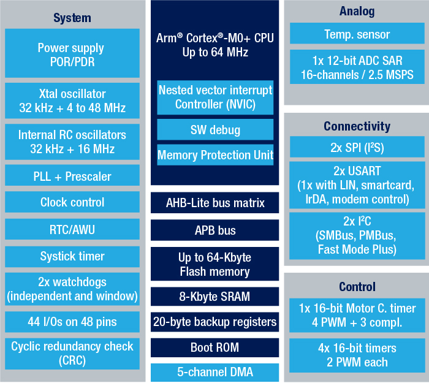

# [STM32G030](https://github.com/SoCXin/STM32G030)

* [ST](https://www.st.com/zh/): [Cortex-M0+](https://github.com/SoCXin/Cortex) 90 nm
* [L3R3](https://github.com/SoCXin/Level): 64 MHz (59 DMIPS, 142 CoreMark)

## [简介](https://github.com/SoCXin/STM32G030/wiki)

### 关键特性

* 64 MHz Cortex-M0+, 59 DMIPS
* 1x 12bit 16ch SAR ADC (2.5 MSPS)
* 5ch x DMA
* 1KB OTP
* RTC
* I2S

### [资源收录](https://github.com/SoCXin)

* [参考资源](src/)
* [相关文档](docs/)
* [典型应用](project/)
* [Xin知识](https://docs.soc.xin/STM32G030)

### [选型建议](https://github.com/SoCXin)

[STM32G0](https://www.st.com/zh/microcontrollers-microprocessors/stm32g0-series.html)支持更广泛的封装和内存组合，同时具备STM32系列的基本功能，特别适合成本敏感型应用。

 [STM32G031](https://www.st.com/content/st_com/zh/products/microcontrollers-microprocessors/stm32-32-bit-arm-cortex-mcus/stm32-mainstream-mcus/stm32g0-series/stm32g0x1.html) 相较 [STM32G030](https://www.st.com/content/st_com/zh/products/microcontrollers-microprocessors/stm32-32-bit-arm-cortex-mcus/stm32-mainstream-mcus/stm32g0-series/stm32g0x0-value-line.html) 模拟升级功能并增加安全功能，最主要的包括新增 USB-PD/CAN-FD/AES256，产品的型号规格更加丰富。

STM32G0x0超值系列的应用设计者能够随时升级到STM32G0x1（得益于完全的引脚排列兼容性）。

如果[STM32G030](https://docs.soc.xin/ST/L/STM32G030.html#id14)不能解决你的问题，那就是也可以考虑用全家桶旗舰[STM32H730](https://github.com/SoCXin/STM32H730)

#### 相关规格

* STM32G030J:SO8N (4.9x6mm)
* STM32G030F:TSSOP20
* STM32G030K:LQFP32
* STM32G030C:LQFP48

#### 高可用度开源项目

* [Arduino_Core_STM32](https://github.com/stm32duino/Arduino_Core_STM32)
* [STM32CubeG0](https://github.com/STMicroelectronics/STM32CubeG0)
* [rust API](https://github.com/stm32-rs/stm32g0xx-hal)

### [探索芯世界 www.SoC.Xin](http://www.SoC.Xin)
