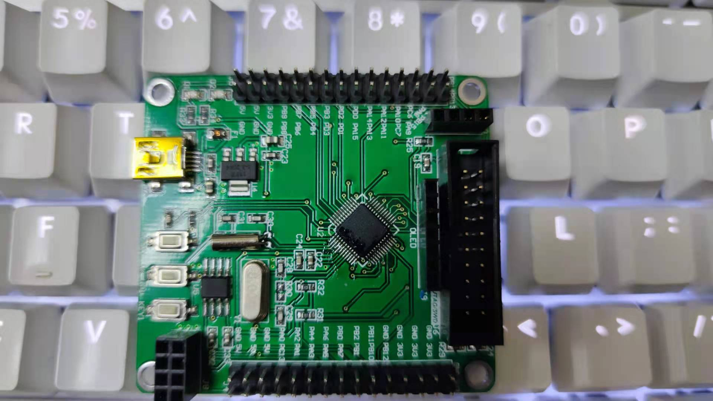

# [STM32G030](https://github.com/SoCXin/STM32G030)

* [ST](https://www.st.com/zh/): [Cortex-M0](https://github.com/SoCXin/Cortex)
* [L3R3](https://github.com/SoCXin/Level): 64 MHz (59 DMIPS, 142 CoreMark)

## [简介](https://github.com/SoCXin/STM32G030/wiki)

### 关键特性

* 精确的内部时钟
* 12bit ADC（2.5 MSps）
* 5ch x DMA

### [资源收录](https://github.com/SoCXin)

* [参考资源](src/)
* [相关文档](docs/)
* [典型应用](project/)
* [入门教程](https://blog.csdn.net/StormsWzx/article/details/104100723)

### [选型建议](https://github.com/SoCXin)

[STM32G0](https://www.st.com/zh/microcontrollers-microprocessors/stm32g0-series.html)支持更广泛的封装和内存组合，同时具备STM32系列的基本功能，特别适合成本敏感型应用。

#### 相关规格

* STM32G030J:SO8N
* STM32G030F:TSSOP20
* STM32G030K:LQFP32
* STM32G030C:LQFP48

### 验证开发板

#### 高可用度开源项目

* [Arduino_Core_STM32](https://github.com/stm32duino/Arduino_Core_STM32)
* [STM32CubeG0](https://github.com/STMicroelectronics/STM32CubeG0)
* [rust API](https://github.com/stm32-rs/stm32g0xx-hal)

### [探索芯世界 www.SoC.xin](http://www.SoC.Xin)
