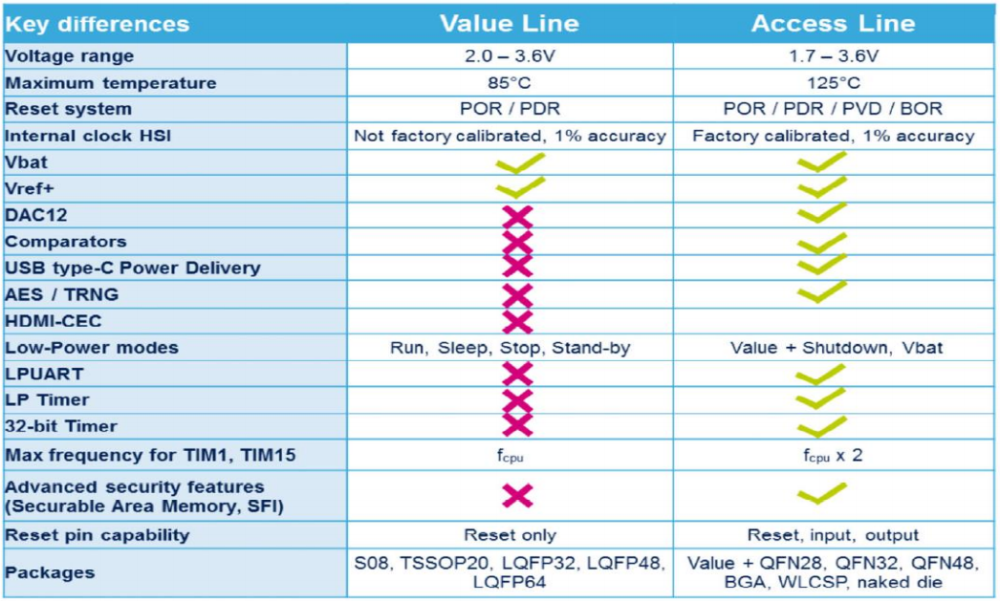

# [STM32G030](https://www.soc.xin/STM32G030)

* [ST](https://www.st.com/zh/): [Cortex-M0+](https://github.com/SoCXin/Cortex)
* [L2R2](https://github.com/SoCXin/Level): 64 MHz , [￥3.86(LQFP-48)](https://item.szlcsc.com/549607.html)

## [简介](https://github.com/SoCXin/STM32G030/wiki)

[STM32G030](https://www.st.com/zh/microcontrollers-microprocessors/stm32g0-series.html)是目前ST最具性价比的低成本MCU产品，拥有出色的性能和完善的开发资源，在该级别产品中拥有非常出色的表现。

### 关键参数

* 64 MHz Cortex-M0+ (59 DMIPS, 142 CoreMark)
* 8KB SRAM + 64KB Flash
* 1x 12bit 16ch SAR ADC (2.5 MSPS)
* 5ch x DMA
* 1KB OTP

## [资源收录](https://github.com/SoCXin)

* [参考资源](src/)
* [参考文档](docs/)
* [参考工程](project/)

可以使用[platform-stm32](https://github.com/OS-Q/platform-stm32)进行开发，支持Arduino等多种开发框架。

## [选型建议](https://github.com/SoCXin/STM32G030)

[STM32G030](https://item.szlcsc.com/549607.html)支持广泛的封装和内存组合，同时继承STM32强大的生态，特别适合成本敏感型应用。

[TSSOP-20(￥2.56)](https://item.szlcsc.com/769428.html)具有很高的性价比。但是相对而言这个封装定位的国产MCU还有很多有力的竞争者，如[PY32F002](https://github.com/SoCXin/PY32F002)。

[STM32G031](https://www.st.com/content/st_com/zh/products/microcontrollers-microprocessors/stm32-32-bit-arm-cortex-mcus/stm32-mainstream-mcus/stm32g0-series/stm32g0x1.html) 相较 [STM32G030](https://www.st.com/content/st_com/zh/products/microcontrollers-microprocessors/stm32-32-bit-arm-cortex-mcus/stm32-mainstream-mcus/stm32g0-series/stm32g0x0-value-line.html) 模拟升级功能并增加安全功能，最主要的包括新增 USB-PD/CAN-FD/AES256，产品的型号规格更加丰富。

### 开源方案

* [Arduino_Core](https://github.com/stm32duino/Arduino_Core_STM32)
* [STM32CubeG0](https://github.com/STMicroelectronics/STM32CubeG0)
* [rust API](https://github.com/stm32-rs/stm32g0xx-hal)
* [PikaPython](https://github.com/OS-Q/PikaPython)

